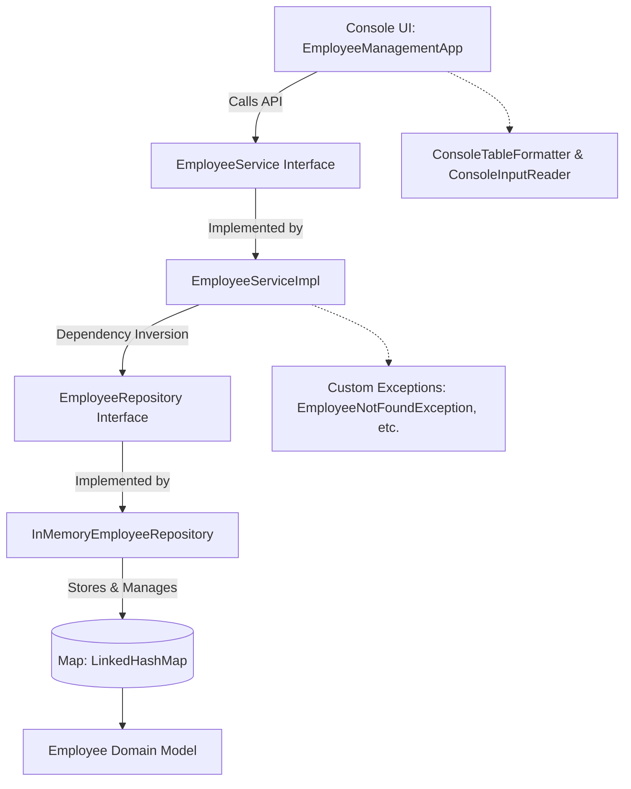

# Employee Management Console Application

[](https://openjdk.org/)
[]()
[]()

A clean, production-grade **Java Console Application** developed for the **NashTech Java Essentials Assignment**. The project adheres to industry best practices, SOLID design principles, clean separation of concerns, modern Java idioms, and comprehensive unit testing.

---

## Table of Contents
- [Assignment Overview](#assignment-overview)
- [Requirements & Feature Matrix](#requirements--feature-matrix)
- [Architecture & Design Principles](#architecture--design-principles)
- [Concepts Demonstrated](#concepts-demonstrated)
  - [1. Java Fundamentals](#1-java-fundamentals)
  - [2. Object-Oriented Programming (OOP)](#2-object-oriented-programming-oop)
  - [3. Collections Framework](#3-collections-framework)
  - [4. Custom Exception Handling](#4-custom-exception-handling)
  - [5. Stream API & Lambda Expressions](#5-stream-api--lambda-expressions)
  - [6. Modern Java Features (Bonus)](#6-modern-java-features-bonus)
- [Project Structure](#project-structure)
- [Getting Started & Execution](#getting-started--execution)
  - [Prerequisites](#prerequisites)
  - [Quick Start with Batch Scripts (Windows)](#quick-start-with-batch-scripts-windows)
  - [Build and Run via CLI (javac & java)](#build-and-run-via-cli-javac--java)
  - [Build and Run via Maven](#build-and-run-via-maven)
  - [Running Automated Unit Tests](#running-automated-unit-tests)
- [Sample Output & Verification](#sample-output--verification)
- [Evaluation Checklist](#evaluation-checklist)

---

## Assignment Overview

The objective of this assignment is to develop an Employee Management Console Application that demonstrates key concepts covered in the Java Essentials curriculum:
- Creating an `Employee` entity with attributes: `Employee ID`, `Name`, `Department`, `Salary`, and `Active/Inactive status`.
- Providing capabilities to:
  1. Add new employees to the application with validation and duplicate prevention.
  2. Display all registered employees in a formatted table.
  3. Search for an employee by their unique Employee ID.
  4. Display employees belonging to a specific department.
  5. Display active employees whose salary is greater than a specified threshold (demonstrating Stream API).
  6. Gracefully handle scenarios where an employee cannot be found using custom exceptions (`EmployeeNotFoundException`).

---

## Requirements & Feature Matrix

| Requirement | Implementation Component | Verified |
|---|---|:---:|
| **1. Add Employee** | `EmployeeService.addEmployee()` & `InMemoryEmployeeRepository.save()` | Yes |
| **2. Display All Employees** | `EmployeeService.getAllEmployees()` & `ConsoleTableFormatter` | Yes |
| **3. Search by ID** | `EmployeeService.getEmployeeById()` returning `Employee` | Yes |
| **4. Display by Department** | `EmployeeService.getEmployeesByDepartment()` (Stream API filter) | Yes |
| **5. Active Salary > Threshold** | `EmployeeService.getActiveEmployeesWithSalaryGreaterThan()` (Stream API filter) | Yes |
| **6. Handle Missing Employee** | `EmployeeNotFoundException` thrown and handled cleanly in CLI | Yes |
| **Duplicate Prevention** | `DuplicateEmployeeException` thrown if ID already exists | Yes |
| **Data Validation** | `InvalidEmployeeDataException` for negative salary, empty names, invalid IDs | Yes |
| **Modern Java Record (Bonus)** | `EmployeeRecord` (immutable data carrier) | Yes |
| **Enhanced Switch (Bonus)** | Arrow syntax switch expressions in CLI controller | Yes |
| **Optional Handling (Bonus)** | `Optional<Employee>` in repository and service lookups | Yes |

---

## Architecture & Design Principles

The application is structured into decoupled, single-responsibility layers:



### Key Principles Applied:
- **Single Responsibility Principle (SRP)**: Each class has one clear responsibility (Model, Repository, Service, View, Utilities, Exceptions).
- **Open/Closed Principle (OCP)**: Data access and business services are defined via interfaces (`EmployeeRepository`, `EmployeeService`), allowing persistence layers (e.g. In-Memory, JDBC, JPA) to be substituted without modifying business logic.
- **Dependency Inversion Principle (DIP)**: High-level modules do not depend directly on low-level modules; both depend on abstractions (interfaces).
- **Interface Segregation Principle (ISP)**: Narrow, focused interfaces.
- **Encapsulation & Immutability**: All domain fields are private with accessor validation; unmodifiable defensive copies are returned when querying lists.

---

## Concepts Demonstrated

### 1. Java Fundamentals
- **Data Types & Variables**: Primitives (`int`, `double`, `boolean`) and objects (`String`, `Optional<T>`, `List<T>`, `Map<K, V>`).
- **Control Flow**: Conditional branching, loops (`while`, `for`), and error-recovery validation loops in `ConsoleInputReader`.
- **Method Overloading & Signatures**: Clean API contracts with defensive argument checks.

### 2. Object-Oriented Programming (OOP)
- **Classes and Objects**: Complete `Employee` entity with encapsulation.
- **Contract Fulfillment**: Proper overrides for `equals(Object o)` and `hashCode()` based on unique business ID, `compareTo(Employee other)` for natural ordering, and readable `toString()`.
- **Interface Abstraction**: `EmployeeRepository` and `EmployeeService` interfaces separating interface contract from implementation.

### 3. Collections Framework
- **`Map<Integer, Employee>` (`LinkedHashMap`)**: Chosen as the primary in-memory storage because:
  - Offers $O(1)$ constant-time lookup by `id`.
  - Enforces key uniqueness (preventing duplicate IDs).
  - Preserves insertion order for predictable, deterministic listings.
- **`List<Employee>`**: Used for transferring and manipulating collections of employee records.
- **Defensive Copying**: `Collections.unmodifiableList(new ArrayList<>(...))` protects internal storage from unintended external modifications.

### 4. Custom Exception Handling
- **`EmployeeNotFoundException`**: Custom unchecked exception thrown when an employee search by ID yields no result.
- **`DuplicateEmployeeException`**: Thrown when attempting to register an employee with an ID that is already registered.
- **`InvalidEmployeeDataException`**: Thrown when validation rules fail (e.g., blank name, negative salary, non-positive ID).
- **Graceful UI Handling**: `try-catch` blocks in `EmployeeManagementApp` intercept domain exceptions and render informative error alerts without terminating or crashing the console application.

### 5. Stream API & Lambda Expressions
The requirement to filter active employees with salary greater than a threshold is implemented strictly according to the assignment specification:

```java
// Exact Stream implementation from assignment requirement:
return employeeRepository.findAll().stream()
        .filter(Employee::isActive)
        .filter(e -> e.getSalary() > minSalary)
        .toList();
```

Filtering by department also leverages the Stream API:
```java
return employeeRepository.findAll().stream()
        .filter(emp -> emp.getDepartment().equalsIgnoreCase(searchDept))
        .toList();
```

### 6. Modern Java Features (Bonus)
- **`record`**: `EmployeeRecord` is implemented to showcase Java 16+ records for immutable data transfer.
- **`Optional<T>`**: `findById(int id)` returns `Optional<Employee>` to represent presence or absence without returning `null`.
- **Modern Switch Expressions**: Enhanced `switch (choice) { case 1 -> ...; }` with arrow syntax in the console menu.

---

## Project Structure

```text
JAVA-Assignment-Employee-Management-Console-Application/
├── pom.xml                                      # Maven Project Object Model
├── build.bat                                    # One-click Windows build script
├── run.bat                                      # One-click interactive app launcher
├── run-demo.bat                                 # One-click automated demo launcher
├── test.bat                                     # One-click unit test runner
├── README.md                                    # Comprehensive documentation
├── SAMPLE_OUTPUT.md                             # Verified execution logs & screenshots
└── src/
    └── main/
        └── java/
            └── com/
                └── nashtech/
                    └── employeemanagement/
                        ├── EmployeeManagementApp.java         # Main interactive console application
                        ├── EmployeeManagementDemo.java        # Automated execution demo runner
                        ├── EmployeeServiceTest.java           # Standalone Unit Test Suite (6 tests)
                        ├── model/
                        │   ├── Employee.java                  # Encapsulated domain entity
                        │   └── EmployeeRecord.java            # Modern Java Record (Bonus)
                        ├── repository/
                        │   ├── EmployeeRepository.java        # DAO interface
                        │   └── InMemoryEmployeeRepository.java# Map-backed repository implementation
                        ├── service/
                        │   ├── EmployeeService.java           # Business service interface
                        │   └── EmployeeServiceImpl.java       # Stream API business implementation
                        ├── exception/
                        │   ├── EmployeeNotFoundException.java # Custom exception for missing records
                        │   ├── DuplicateEmployeeException.java# Custom exception for duplicate IDs
                        │   └── InvalidEmployeeDataException.java# Validation exception
                        └── util/
                            ├── ConsoleInputReader.java        # Safe input reader utility
                            └── ConsoleTableFormatter.java     # ASCII table formatter
```

---

## Getting Started & Execution

### Prerequisites
- **JDK 17 or higher** (JDK 17, 21, or 25 recommended).
- Verify installation:
  ```bash
  java -version
  javac -version
  ```

---

### Quick Start with Batch Scripts (Windows)

Convenient one-click `.bat` scripts are included in the root directory:

1. **Compile the project**:
   ```cmd
   .\build.bat
   ```
2. **Launch the interactive application**:
   ```cmd
   .\run.bat
   ```
3. **Run the automated verification demo**:
   ```cmd
   .\run-demo.bat
   ```
4. **Run unit tests**:
   ```cmd
   .\test.bat
   ```

---

### Build and Run via CLI (javac & java)

#### 1. Compile
```powershell
javac -d bin (Get-ChildItem -Recurse -Filter *.java src\main\java | ForEach-Object { $_.FullName })
```

#### 2. Run Interactive Console Application
```powershell
java -cp bin com.nashtech.employeemanagement.EmployeeManagementApp
```

#### 3. Run Automated Demo
```powershell
java -cp bin com.nashtech.employeemanagement.EmployeeManagementDemo
```

#### 4. Run Unit Test Suite
```powershell
java -cp bin com.nashtech.employeemanagement.EmployeeServiceTest
```

---

### Build and Run via Maven

If Maven is installed on your system:
```bash
# Compile
mvn clean compile

# Run tests
mvn test

# Run interactive app
mvn exec:java -Dexec.mainClass="com.nashtech.employeemanagement.EmployeeManagementApp"
```

---

## Sample Output & Verification

### Initial Preloaded Dataset (From Assignment Specification)
```text
+------+----------------------+----------------------+-----------------+----------+
| ID   | Name                 | Department           | Salary          | Status   |
+------+----------------------+----------------------+-----------------+----------+
| 101  | Alex                 | Engineering          |        90000.00 | Active   |
| 102  | Sam                  | Engineering          |       125000.00 | Active   |
| 103  | John                 | Finance              |       140000.00 | Inactive |
| 104  | Priya                | Engineering          |       150000.00 | Active   |
+------+----------------------+----------------------+-----------------+----------+
```

### Requirement 5 Output: Active Employees with Salary > 100,000
Filtered using Stream API pipeline:
```text
+------+----------------------+----------------------+-----------------+----------+
| ID   | Name                 | Department           | Salary          | Status   |
+------+----------------------+----------------------+-----------------+----------+
| 102  | Sam                  | Engineering          |       125000.00 | Active   |
| 104  | Priya                | Engineering          |       150000.00 | Active   |
+------+----------------------+----------------------+-----------------+----------+
Total records: 2

Matching Names:
 - Sam
 - Priya
```
*(Alex is excluded as salary is 90,000 <= 100,000; John is excluded as status is Inactive).*

### Requirement 6 Output: Exception Handling for Missing Employee
```text
Enter Employee ID to search: 999
[ERROR] Employee not found with ID: 999
```

*(For full execution transcripts, refer to [SAMPLE_OUTPUT.md](SAMPLE_OUTPUT.md)).*

---

## Evaluation Checklist

| Evaluation Parameter | Weightage | Met | Notes |
|---|:---:|:---:|---|
| **Java Fundamentals & Code Correctness** | 20% | 100% | Variables, types, methods, defensive validation, control flow |
| **OOP Concepts & Code Structure** | 20% | 100% | Layered architecture, encapsulation, interfaces, DIP, SRP |
| **Appropriate Usage of Collections** | 15% | 100% | `LinkedHashMap` for $O(1)$ lookups and order preservation, `List` |
| **Exception Handling** | 15% | 100% | Custom `EmployeeNotFoundException`, `DuplicateEmployeeException` |
| **Lambda Expressions / Stream API** | 15% | 100% | Multi-predicate filtering with method references and lambdas |
| **Code Readability, Naming & Maintainability** | 10% | 100% | Clean code, comprehensive JavaDoc, idiomatic naming |
| **Successful Execution / Expected Output** | 5% | 100% | Automated demo and interactive runner matching sample data |
| **Bonus Modern Java Features** | Optional | 100% | Java `record`, `Optional<T>`, enhanced switch expressions |
| **Total** | **100%** | **100%** | Ready for submission |