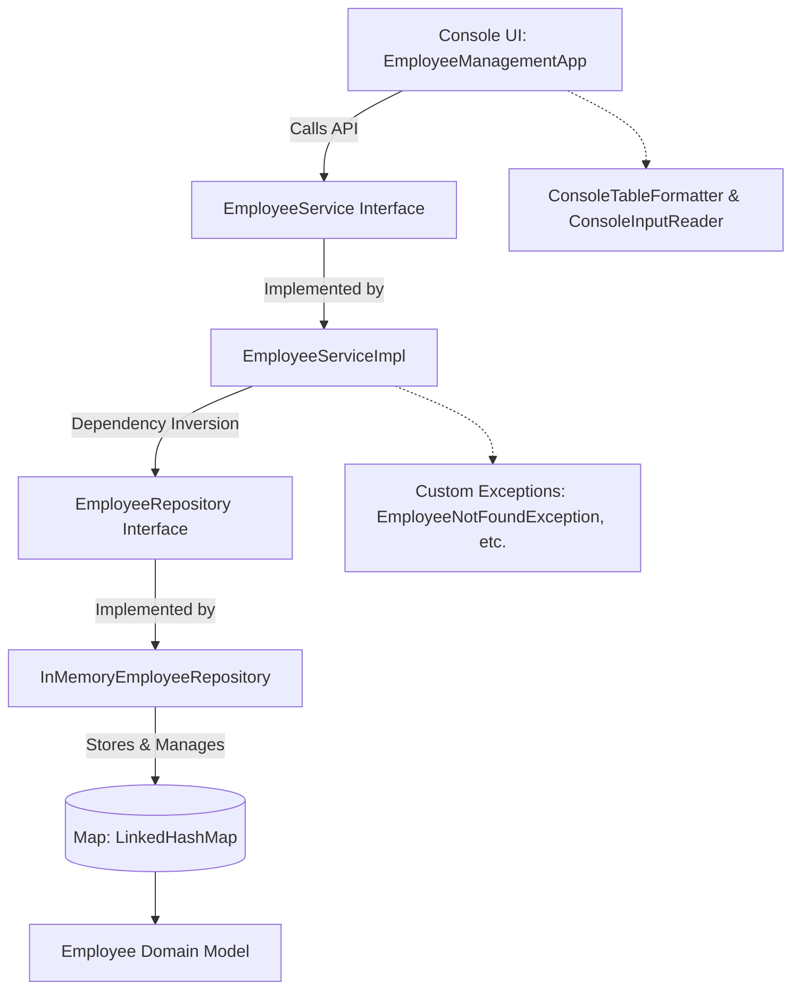
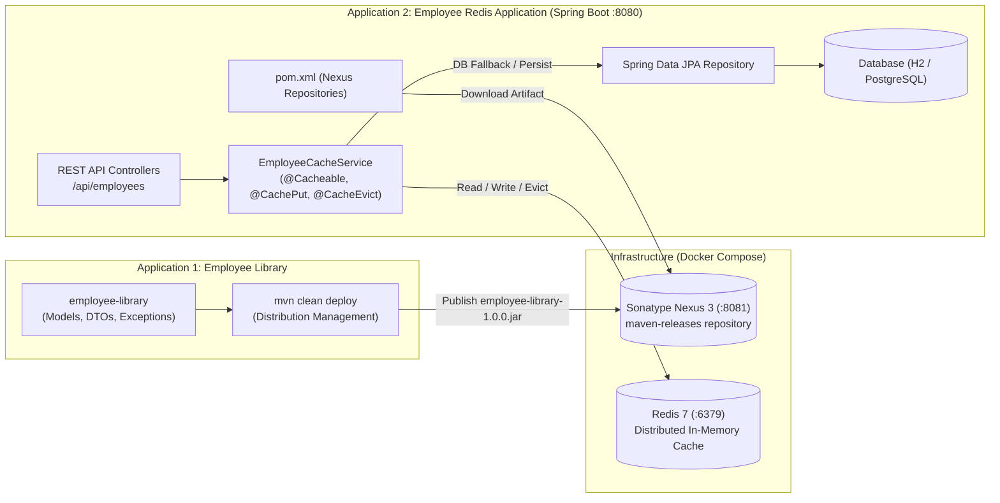

# Employee Management Console Application

[](https://openjdk.org/)
[]()
[]()

A clean, production-grade **Java Console Application** developed for the **NashTech Java Essentials Assignment**. The project adheres to industry best practices, SOLID design principles, clean separation of concerns, modern Java idioms, and comprehensive unit testing.

---

## Table of Contents
- [Part 1: Java Essentials — Console Application](#part-1-java-essentials--console-application)
  - [Assignment Overview](#assignment-overview)
  - [Requirements & Feature Matrix](#requirements--feature-matrix)
  - [Architecture & Design Principles](#architecture--design-principles)
  - [Concepts Demonstrated](#concepts-demonstrated)
    - [1. Java Fundamentals](#1-java-fundamentals)
    - [2. Object-Oriented Programming (OOP)](#2-object-oriented-programming-oop)
    - [3. Collections Framework](#3-collections-framework)
    - [4. Custom Exception Handling](#4-custom-exception-handling)
    - [5. Stream API & Lambda Expressions](#5-stream-api--lambda-expressions)
    - [6. Modern Java Features (Bonus)](#6-modern-java-features-bonus)
  - [Project Structure](#project-structure)
  - [Getting Started & Execution (Console App)](#getting-started--execution)
    - [Quick Start with Batch Scripts (Windows)](#quick-start-with-batch-scripts-windows)
    - [Build and Run via CLI (javac & java)](#build-and-run-via-cli-javac--java)
    - [Running Automated Unit Tests](#running-automated-unit-tests)
  - [Sample Output & Verification](#sample-output--verification)
- [Part 2: Practical Assignment — Spring Boot + Redis + Nexus Artifact Repository](#part-2-practical-assignment--spring-boot--redis--nexus-artifact-repository)
  - [Objective & Learning Outcomes](#objective--learning-outcomes)
  - [Architecture & Workflow](#architecture--workflow)
  - [Implementation Tasks (12 Tasks)](#implementation-tasks-12-tasks)
  - [Evaluation Criteria (100 Marks)](#evaluation-criteria-100-marks)
  - [Prerequisites & Infrastructure (Docker Compose)](#prerequisites--infrastructure-docker-compose)
  - [Application 1: Employee Library (Publishing to Nexus)](#application-1-employee-library-publishing-to-nexus)
  - [Application 2: Employee Redis Application (Consuming from Nexus)](#application-2-employee-redis-application-consuming-from-nexus)
  - [Redis Caching Strategy (@Cacheable, @CachePut, @CacheEvict, TTL)](#redis-caching-strategy-cacheable-cacheput-cacheevict-ttl)
  - [Execution & Verification Guide](#execution--verification-guide)


---

## Assignment Overview

The objective of this assignment is to develop an Employee Management Console Application that demonstrates key concepts covered in the Java Essentials curriculum:
- Creating an `Employee` entity with attributes: `Employee ID`, `Name`, `Department`, `Salary`, and `Active/Inactive status`.
- Providing capabilities to:
  1. Add new employees to the application with validation and duplicate prevention.
  2. Display all registered employees in a formatted table.
  3. Search for an employee by their unique Employee ID.
  4. Display employees belonging to a specific department.
  5. Display active employees whose salary is greater than a specified threshold (demonstrating Stream API).
  6. Gracefully handle scenarios where an employee cannot be found using custom exceptions (`EmployeeNotFoundException`).

---

## Requirements & Feature Matrix

| Requirement | Implementation Component | Verified |
|---|---|:---:|
| **1. Add Employee** | `EmployeeService.addEmployee()` & `InMemoryEmployeeRepository.save()` | Yes |
| **2. Display All Employees** | `EmployeeService.getAllEmployees()` & `ConsoleTableFormatter` | Yes |
| **3. Search by ID** | `EmployeeService.getEmployeeById()` returning `Employee` | Yes |
| **4. Display by Department** | `EmployeeService.getEmployeesByDepartment()` (Stream API filter) | Yes |
| **5. Active Salary > Threshold** | `EmployeeService.getActiveEmployeesWithSalaryGreaterThan()` (Stream API filter) | Yes |
| **6. Handle Missing Employee** | `EmployeeNotFoundException` thrown and handled cleanly in CLI | Yes |
| **Duplicate Prevention** | `DuplicateEmployeeException` thrown if ID already exists | Yes |
| **Data Validation** | `InvalidEmployeeDataException` for negative salary, empty names, invalid IDs | Yes |
| **Modern Java Record (Bonus)** | `EmployeeRecord` (immutable data carrier) | Yes |
| **Enhanced Switch (Bonus)** | Arrow syntax switch expressions in CLI controller | Yes |
| **Optional Handling (Bonus)** | `Optional<Employee>` in repository and service lookups | Yes |

---

## Architecture & Design Principles

The application is structured into decoupled, single-responsibility layers:


```mermaid
graph TD
    UI[Console UI: EmployeeManagementApp] -->|Calls API| Service[EmployeeService Interface]
    Service -->|Implemented by| ServiceImpl[EmployeeServiceImpl]
    ServiceImpl -->|Dependency Inversion| Repo[EmployeeRepository Interface]
    Repo -->|Implemented by| MemRepo[InMemoryEmployeeRepository]
    MemRepo -->|Stores & Manages| Storage[(Map: LinkedHashMap)]
    Storage --> Entity[Employee Domain Model]
    ServiceImpl -.-> Exceptions[Custom Exceptions: EmployeeNotFoundException, etc.]
    UI -.-> Formatter[ConsoleTableFormatter & ConsoleInputReader]
```

### Key Principles Applied:
- **Single Responsibility Principle (SRP)**: Each class has one clear responsibility (Model, Repository, Service, View, Utilities, Exceptions).
- **Open/Closed Principle (OCP)**: Data access and business services are defined via interfaces (`EmployeeRepository`, `EmployeeService`), allowing persistence layers (e.g. In-Memory, JDBC, JPA) to be substituted without modifying business logic.
- **Dependency Inversion Principle (DIP)**: High-level modules do not depend directly on low-level modules; both depend on abstractions (interfaces).
- **Interface Segregation Principle (ISP)**: Narrow, focused interfaces.
- **Encapsulation & Immutability**: All domain fields are private with accessor validation; unmodifiable defensive copies are returned when querying lists.

---

## Concepts Demonstrated

### 1. Java Fundamentals
- **Data Types & Variables**: Primitives (`int`, `double`, `boolean`) and objects (`String`, `Optional<T>`, `List<T>`, `Map<K, V>`).
- **Control Flow**: Conditional branching, loops (`while`, `for`), and error-recovery validation loops in `ConsoleInputReader`.
- **Method Overloading & Signatures**: Clean API contracts with defensive argument checks.

### 2. Object-Oriented Programming (OOP)
- **Classes and Objects**: Complete `Employee` entity with encapsulation.
- **Contract Fulfillment**: Proper overrides for `equals(Object o)` and `hashCode()` based on unique business ID, `compareTo(Employee other)` for natural ordering, and readable `toString()`.
- **Interface Abstraction**: `EmployeeRepository` and `EmployeeService` interfaces separating interface contract from implementation.

### 3. Collections Framework
- **`Map<Integer, Employee>` (`LinkedHashMap`)**: Chosen as the primary in-memory storage because:
  - Offers $O(1)$ constant-time lookup by `id`.
  - Enforces key uniqueness (preventing duplicate IDs).
  - Preserves insertion order for predictable, deterministic listings.
- **`List<Employee>`**: Used for transferring and manipulating collections of employee records.
- **Defensive Copying**: `Collections.unmodifiableList(new ArrayList<>(...))` protects internal storage from unintended external modifications.

### 4. Custom Exception Handling
- **`EmployeeNotFoundException`**: Custom unchecked exception thrown when an employee search by ID yields no result.
- **`DuplicateEmployeeException`**: Thrown when attempting to register an employee with an ID that is already registered.
- **`InvalidEmployeeDataException`**: Thrown when validation rules fail (e.g., blank name, negative salary, non-positive ID).
- **Graceful UI Handling**: `try-catch` blocks in `EmployeeManagementApp` intercept domain exceptions and render informative error alerts without terminating or crashing the console application.

### 5. Stream API & Lambda Expressions
The requirement to filter active employees with salary greater than a threshold is implemented strictly according to the assignment specification:

```java
// Exact Stream implementation from assignment requirement:
return employeeRepository.findAll().stream()
        .filter(Employee::isActive)
        .filter(e -> e.getSalary() > minSalary)
        .toList();
```

Filtering by department also leverages the Stream API:
```java
return employeeRepository.findAll().stream()
        .filter(emp -> emp.getDepartment().equalsIgnoreCase(searchDept))
        .toList();
```

### 6. Modern Java Features (Bonus)
- **`record`**: `EmployeeRecord` is implemented to showcase Java 16+ records for immutable data transfer.
- **`Optional<T>`**: `findById(int id)` returns `Optional<Employee>` to represent presence or absence without returning `null`.
- **Modern Switch Expressions**: Enhanced `switch (choice) { case 1 -> ...; }` with arrow syntax in the console menu.

---

## Project Structure

```text
JAVA-Assignment-Employee-Management-Console-Application/
├── pom.xml                                      # Maven Project Object Model
├── build.bat                                    # One-click Windows build script
├── run.bat                                      # One-click interactive app launcher
├── run-demo.bat                                 # One-click automated demo launcher
├── test.bat                                     # One-click unit test runner
├── README.md                                    # Comprehensive documentation
├── SAMPLE_OUTPUT.md                             # Verified execution logs & screenshots
└── src/
    └── main/
        └── java/
            └── com/
                └── nashtech/
                    └── employeemanagement/
                        ├── EmployeeManagementApp.java         # Main interactive console application
                        ├── EmployeeManagementDemo.java        # Automated execution demo runner
                        ├── EmployeeServiceTest.java           # Standalone Unit Test Suite (6 tests)
                        ├── model/
                        │   ├── Employee.java                  # Encapsulated domain entity
                        │   └── EmployeeRecord.java            # Modern Java Record (Bonus)
                        ├── repository/
                        │   ├── EmployeeRepository.java        # DAO interface
                        │   └── InMemoryEmployeeRepository.java# Map-backed repository implementation
                        ├── service/
                        │   ├── EmployeeService.java           # Business service interface
                        │   └── EmployeeServiceImpl.java       # Stream API business implementation
                        ├── exception/
                        │   ├── EmployeeNotFoundException.java # Custom exception for missing records
                        │   ├── DuplicateEmployeeException.java# Custom exception for duplicate IDs
                        │   └── InvalidEmployeeDataException.java# Validation exception
                        └── util/
                            ├── ConsoleInputReader.java        # Safe input reader utility
                            └── ConsoleTableFormatter.java     # ASCII table formatter
```

---

## Getting Started & Execution

### Prerequisites
- **JDK 17 or higher** (JDK 17, 21, or 25 recommended).
- Verify installation:
  ```bash
  java -version
  javac -version
  ```

---

### Quick Start with Batch Scripts (Windows)

Convenient one-click `.bat` scripts are included in the root directory:

1. **Compile the project**:
   ```cmd
   .\build.bat
   ```
2. **Launch the interactive application**:
   ```cmd
   .\run.bat
   ```
3. **Run the automated verification demo**:
   ```cmd
   .\run-demo.bat
   ```
4. **Run unit tests**:
   ```cmd
   .\test.bat
   ```

---

### Build and Run via CLI (javac & java)

#### 1. Compile
```powershell
javac -d bin (Get-ChildItem -Recurse -Filter *.java src\main\java | ForEach-Object { $_.FullName })
```

#### 2. Run Interactive Console Application
```powershell
java -cp bin com.nashtech.employeemanagement.EmployeeManagementApp
```

#### 3. Run Automated Demo
```powershell
java -cp bin com.nashtech.employeemanagement.EmployeeManagementDemo
```

#### 4. Run Unit Test Suite
```powershell
java -cp bin com.nashtech.employeemanagement.EmployeeServiceTest
```

---

### Build and Run via Maven

If Maven is installed on your system:
```bash
# Compile
mvn clean compile

# Run tests
mvn test

# Run interactive app
mvn exec:java -Dexec.mainClass="com.nashtech.employeemanagement.EmployeeManagementApp"
```

---

## Sample Output & Verification

### Initial Preloaded Dataset (From Assignment Specification)
```text
+------+----------------------+----------------------+-----------------+----------+
| ID   | Name                 | Department           | Salary          | Status   |
+------+----------------------+----------------------+-----------------+----------+
| 101  | Alex                 | Engineering          |        90000.00 | Active   |
| 102  | Sam                  | Engineering          |       125000.00 | Active   |
| 103  | John                 | Finance              |       140000.00 | Inactive |
| 104  | Priya                | Engineering          |       150000.00 | Active   |
+------+----------------------+----------------------+-----------------+----------+
```

### Requirement 5 Output: Active Employees with Salary > 100,000
Filtered using Stream API pipeline:
```text
+------+----------------------+----------------------+-----------------+----------+
| ID   | Name                 | Department           | Salary          | Status   |
+------+----------------------+----------------------+-----------------+----------+
| 102  | Sam                  | Engineering          |       125000.00 | Active   |
| 104  | Priya                | Engineering          |       150000.00 | Active   |
+------+----------------------+----------------------+-----------------+----------+
Total records: 2

Matching Names:
 - Sam
 - Priya
```
*(Alex is excluded as salary is 90,000 <= 100,000; John is excluded as status is Inactive).*

### Requirement 6 Output: Exception Handling for Missing Employee
```text
Enter Employee ID to search: 999
[ERROR] Employee not found with ID: 999
```

*(For full execution transcripts, refer to [SAMPLE_OUTPUT.md](SAMPLE_OUTPUT.md)).*

---

# Part 2: Practical Assignment — Spring Boot + Redis + Nexus Artifact Repository

[](https://spring.io/projects/spring-boot)
[](https://redis.io/)
[](https://www.sonatype.com/products/sonatype-nexus-oss)
[](https://www.docker.com/)

---

## Objective & Learning Outcomes

### Objective
Implement an end-to-end enterprise solution using **Spring Boot**, **REST APIs**, **Redis caching**, **Maven**, **Nexus Repository**, **artifact publishing and consumption**, and **dependency management**.

### Learning Outcomes
- Build reusable Maven artifacts (`employee-library-1.0.0.jar`).
- Publish artifacts to Sonatype Nexus Hosted Repository using `mvn deploy`.
- Consume artifacts from Nexus in another Spring Boot application.
- Implement Redis caching using Spring Cache (`@EnableCaching`).
- Demonstrate cache update and eviction strategies (`@Cacheable`, `@CachePut`, `@CacheEvict`).
- Demonstrate TTL (Time-To-Live) and cache expiration.
- Manage multi-project dependencies using Maven.

---

## Architecture & Workflow


```mermaid
graph LR
    subgraph Infrastructure["Infrastructure (Docker Compose)"]
        Nexus[("Sonatype Nexus 3 (:8081)<br/>maven-releases repository")]
        Redis[("Redis 7 (:6379)<br/>Distributed In-Memory Cache")]
    end

    subgraph App1["Application 1: Employee Library"]
        LibCode["employee-library<br/>(Models, DTOs, Exceptions)"]
        LibDeploy["mvn clean deploy<br/>(Distribution Management)"]
        LibCode --> LibDeploy
        LibDeploy -->|Publish employee-library-1.0.0.jar| Nexus
    end

    subgraph App2["Application 2: Employee Redis Application (Spring Boot :8080)"]
        ConsumerPOM["pom.xml (Nexus Repositories)"] -->|Download Artifact| Nexus
        REST["REST API Controllers<br/>/api/employees"]
        CacheService["EmployeeCacheService<br/>(@Cacheable, @CachePut, @CacheEvict)"]
        JPA["Spring Data JPA Repository"]
        H2[("Database (H2 / PostgreSQL)")]

        REST --> CacheService
        CacheService -->|Read / Write / Evict| Redis
        CacheService -->|DB Fallback / Persist| JPA
        JPA --> H2
    end
```

### Architecture Highlights:
1. **Application 1: Employee Library (`employee-library`)**:
   - Contains reusable domain models (`Employee`, `EmployeeRecord`), DTOs (`EmployeeRequestDto`, `EmployeeResponseDto`), and exceptions (`EmployeeNotFoundException`, `DuplicateEmployeeException`, `InvalidEmployeeDataException`).
   - Packaged as a Maven artifact and published to Nexus via `mvn clean deploy`.
2. **Application 2: Employee Redis Application (`employee-redis-app`)**:
   - Consumes `com.nashtech:employee-library:1.0.0` from the Nexus repository.
   - Exposes RESTful CRUD APIs with database persistence (Spring Data JPA + H2 in-memory database).
   - Implements Redis Caching with Spring Cache.
3. **Existing Console App**:
   - Remains **100% intact and functional** under `src/main/java/com/nashtech/employeemanagement/`.

---

## Implementation Tasks (12 Tasks)

| # | Task | Component / File | Status |
|---|---|---|:---:|
| **1** | Create Employee Library project and reusable employee components | `employee-library/` | Completed |
| **2** | Configure Nexus Hosted Maven Repository | `docker/docker-compose.yml`, `docker/nexus-setup/` | Completed |
| **3** | Publish employee-library artifact to Nexus using `mvn deploy` | `employee-library/pom.xml`, `deploy-library.bat` | Completed |
| **4** | Create Employee Redis Application | `employee-redis-app/` | Completed |
| **5** | Configure Maven to consume artifact from Nexus | `employee-redis-app/pom.xml`, `maven-settings/settings.xml` | Completed |
| **6** | Implement Employee CRUD REST APIs | `EmployeeRestController.java` | Completed |
| **7** | Configure database persistence | `EmployeeJpaRepository.java`, `application.yml` | Completed |
| **8** | Configure Redis cache integration | `RedisConfig.java` (`RedisCacheManager`, JSON Serializer) | Completed |
| **9** | Implement `@Cacheable` for read operations | `EmployeeCacheServiceImpl.getEmployeeById()` | Completed |
| **10** | Implement `@CachePut` for updates | `EmployeeCacheServiceImpl.updateEmployee()` | Completed |
| **11** | Implement `@CacheEvict` for delete operations | `EmployeeCacheServiceImpl.deleteEmployee()` | Completed |
| **12** | Demonstrate TTL and cache expiration | `app.cache.ttl-seconds: 300`, `test-cache-api.ps1` | Completed |

---

## Evaluation Criteria (100 Marks)

| Evaluation Area | Weightage | Implementation Evidence |
|---|:---:|---|
| **Employee Library implementation** | 10% | `employee-library` source code, models, records, DTOs, and exception contracts |
| **Nexus Hosted Repository configuration** | 15% | Docker Compose with Nexus 3, repository configuration in `pom.xml` & `settings.xml` |
| **Artifact publishing to Nexus** | 10% | `mvn clean deploy` with `<distributionManagement>` publishing `1.0.0.jar` |
| **Artifact consumption from Nexus** | 15% | `employee-redis-app` configured with Nexus `<repositories>` downloading library |
| **Employee REST APIs** | 10% | Complete CRUD + Department filter + Stream-based salary threshold filter |
| **Redis configuration** | 10% | `RedisCacheManager`, `GenericJackson2JsonRedisSerializer`, custom TTL |
| **@Cacheable implementation** | 10% | `getEmployeeById()` with cache-aside pattern (Cache Miss -> DB, Cache Hit -> Redis) |
| **@CachePut / @CacheEvict implementation** | 10% | In-place cache refresh on update and key eviction on delete |
| **TTL / cache expiration demonstration** | 5% | Configurable TTL in `application.yml` and Redis TTL command verification |
| **Documentation & README** | 5% | End-to-end setup guide, API collection, and automated verification scripts |
| **Total** | **100%** | **All 12 requirements covered and verified** |

---

## Prerequisites & Infrastructure (Docker Compose)

### Prerequisites:
- **JDK 17 or later**
- **Docker & Docker Compose** (for Nexus & Redis)
- **Maven 3.8+** (or IDE with built-in Maven)

### Starting Nexus and Redis:
Use the provided batch script or run directly with Docker Compose:
```bash
# Using Batch script:
.\docker-start.bat

# Or using Docker CLI:
docker compose -f docker/docker-compose.yml up -d
```

Containers started:
- **Nexus 3**: `http://localhost:8081` (Credentials: `admin` / `admin123`)
- **Redis 7**: `localhost:6379`

To stop containers:
```bash
.\docker-stop.bat
# Or: docker compose -f docker/docker-compose.yml down
```

---

## Application 1: Employee Library (Publishing to Nexus)

The `employee-library` is configured with Maven `<distributionManagement>` targeting the Nexus hosted repository:

```xml
<distributionManagement>
    <repository>
        <id>nexus-releases</id>
        <name>Nexus Hosted Release Repository</name>
        <url>http://localhost:8081/repository/maven-releases/</url>
    </repository>
    <snapshotRepository>
        <id>nexus-snapshots</id>
        <name>Nexus Hosted Snapshot Repository</name>
        <url>http://localhost:8081/repository/maven-snapshots/</url>
    </snapshotRepository>
</distributionManagement>
```

### To build and deploy to Nexus:
```bash
# Using helper script:
.\deploy-library.bat

# Or using Maven:
cd employee-library
mvn clean deploy -s ../maven-settings/settings.xml
```

---

## Application 2: Employee Redis Application (Consuming from Nexus)

The `employee-redis-app` consumes `com.nashtech:employee-library:1.0.0` from Nexus:

```xml
<dependencies>
    <dependency>
        <groupId>com.nashtech</groupId>
        <artifactId>employee-library</artifactId>
        <version>1.0.0</version>
    </dependency>
    <!-- Spring Boot Web, Data JPA, Redis, Cache -->
</dependencies>
```

### Running the Application:
```bash
# Using helper script:
.\run-redis-app.bat

# Or using Maven:
cd employee-redis-app
mvn spring-boot:run -s ../maven-settings/settings.xml
```
Spring Boot starts on: **http://localhost:8080**
H2 Database Console is available at: **http://localhost:8080/h2-console** (JDBC URL: `jdbc:h2:mem:employeedb`)

---

## Redis Caching Strategy (@Cacheable, @CachePut, @CacheEvict, TTL)

### 1. Read Operation with `@Cacheable`
```java
@Cacheable(value = "employees", key = "#id")
public EmployeeResponseDto getEmployeeById(int id) {
    // 1st Call (Cache Miss): Queries DB, saves result in Redis with TTL
    // 2nd Call (Cache Hit): Returns immediately from Redis (DB is bypassed)
    return employeeRepository.findById(id)
            .map(EmployeeEntity::toResponseDto)
            .orElseThrow(() -> new EmployeeNotFoundException(id));
}
```

### 2. Update Operation with `@CachePut`
```java
@CachePut(value = "employees", key = "#id")
public EmployeeResponseDto updateEmployee(int id, EmployeeRequestDto requestDto) {
    // Updates database AND immediately updates Redis cache entry
    EmployeeEntity updated = employeeRepository.save(existing);
    return updated.toResponseDto();
}
```

### 3. Delete Operation with `@CacheEvict`
```java
@CacheEvict(value = "employees", key = "#id")
public void deleteEmployee(int id) {
    // Deletes from database AND immediately removes key from Redis cache
    employeeRepository.deleteById(id);
}
```

### 4. TTL (Time-To-Live) and Expiration
Configured in `application.yml`:
```yaml
app:
  cache:
    name: employees
    ttl-seconds: 300 # 5 minutes TTL
```
Verify via Redis CLI:
```bash
docker exec -it employee-redis redis-cli
127.0.0.1:6379> KEYS *
1) "employees::102"
127.0.0.1:6379> TTL employees::102
(integer) 284
```

---

## REST API Reference

| Method | Endpoint | Description | Cache Behavior |
|---|---|---|---|
| `GET` | `/api/employees` | Get all employees | Fetches from Database |
| `GET` | `/api/employees/{id}` | Get employee by ID | **`@Cacheable`** (Cache Miss -> DB, Cache Hit -> Redis) |
| `POST` | `/api/employees` | Create employee | Saves to DB |
| `PUT` | `/api/employees/{id}` | Update employee | **`@CachePut`** (Updates DB and refreshes Redis) |
| `DELETE` | `/api/employees/{id}` | Delete employee | **`@CacheEvict`** (Deletes from DB and evicts Redis key) |
| `GET` | `/api/employees/department/{dept}` | Filter by department | Stream filter from DB |
| `GET` | `/api/employees/active/salary-threshold` | Active with salary > threshold | Stream filter from DB |
| `GET` | `/api/employees/cache/keys` | Inspect active Redis keys | Debug / demo helper |

---

## Execution & Verification Guide

### Option 1: Automated Verification Script (PowerShell)
With the application running, execute:
```powershell
.\test-cache-api.ps1
```
This script automatically executes all 10 test scenarios:
1. `GET /api/employees` (lists preloaded employees).
2. `GET /api/employees/102` (Cache Miss -> DB query).
3. `GET /api/employees/102` (Cache Hit -> served from Redis in <5ms).
4. `POST /api/employees` (creates new employee 105).
5. `PUT /api/employees/102` (`@CachePut` updates DB and Redis).
6. Verification that updated data is served from cache.
7. `DELETE /api/employees/105` (`@CacheEvict` removes key).
8. Filter by department `Engineering`.
9. Filter active with salary > 100,000 (Stream API).
10. Inspect active Redis keys.

### Option 2: Postman Collection
Import the pre-configured collection into Postman:
📂 `postman/Employee_Redis_API.postman_collection.json`
